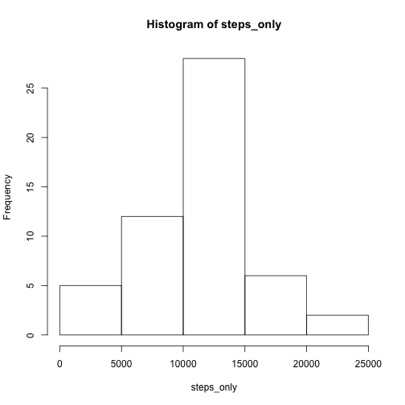
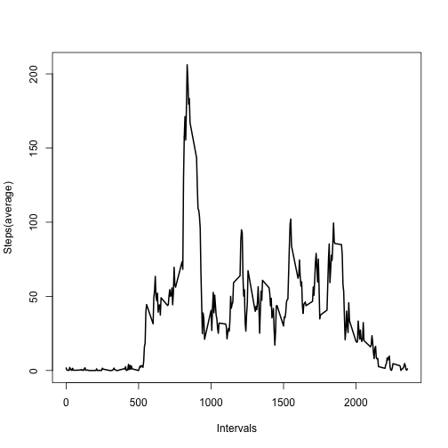
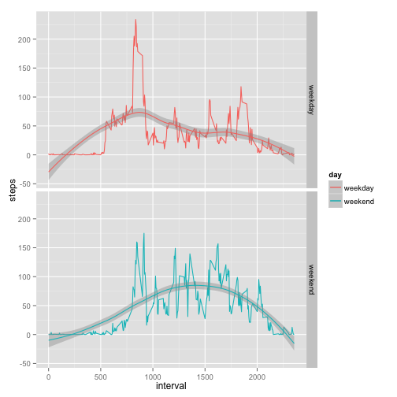

# Reproducible Research: Peer Assessment 1   

## Data   
The data is from a personal activity monitoring device such as a Fitbit, Nike Fuelband, or Jawbone Up. This device collects data at 5 minute intervals through out the day. The data consists of two months of data from an anonymous individual collected during the months of October and November, 2012 and include the number of steps taken in 5 minute intervals each day.

### Dataset   
Dataset: [Activity monitoring data [Zip file, 52K]](https://d396qusza40orc.cloudfront.net/repdata%2Fdata%2Factivity.zip)
The variables included in this dataset are:

- steps: Number of steps taking in a 5-minute interval (missing values are coded as NA)

- date: The date on which the measurement was taken in YYYY-MM-DD format.
  There are 61 days.

- interval: Identifier for the 5-minute interval in which measurement was taken. There are 288 intervals.

The dataset is stored in a comma-separated-value (CSV) file and there are a total of 17,568 observations in this dataset.

## Loading and preprocessing the data      

### 1. Load the data      

```r
## rm(list=ls())
## setwd("/Users/rogerfischer/datasciencecoursera/repdata/RepData_PeerAssessment1")
activity <- unzip("activity.zip")
activity <- read.csv(activity, stringsAsFactors = FALSE)
str(activity)
```

```
## 'data.frame':	17568 obs. of  3 variables:
##  $ steps   : int  NA NA NA NA NA NA NA NA NA NA ...
##  $ date    : chr  "2012-10-01" "2012-10-01" "2012-10-01" "2012-10-01" ...
##  $ interval: int  0 5 10 15 20 25 30 35 40 45 ...
```

```r
summary(activity)
```

```
##      steps            date              interval     
##  Min.   :  0.00   Length:17568       Min.   :   0.0  
##  1st Qu.:  0.00   Class :character   1st Qu.: 588.8  
##  Median :  0.00   Mode  :character   Median :1177.5  
##  Mean   : 37.38                      Mean   :1177.5  
##  3rd Qu.: 12.00                      3rd Qu.:1766.2  
##  Max.   :806.00                      Max.   :2355.0  
##  NA's   :2304
```

### 2. Process/transform the data into a format suitable for the analysis     
Date should be of class date, not character

```r
class(activity$date)
```

```
## [1] "character"
```

```r
activity$date <- strptime(activity$date, "%Y-%m-%d")
class(activity$date)
```

```
## [1] "POSIXlt" "POSIXt"
```

```r
order_by_date <- order(activity$date)
activity <- activity[order_by_date,]
```


## What is mean total number of steps taken per day?    
We ignore the missing values in the dataset.

### 1. Calculate the total number of steps taken per day    

```r
library(dplyr)
```


```r
activity$date <- as.character(activity$date)
by_day <- group_by(activity, date)
steps_by_day <- summarise(by_day, steps = sum(steps))

# View(steps_by_day)
head(steps_by_day)
```

```
## Source: local data frame [6 x 2]
## 
##         date steps
## 1 2012-10-01    NA
## 2 2012-10-02   126
## 3 2012-10-03 11352
## 4 2012-10-04 12116
## 5 2012-10-05 13294
## 6 2012-10-06 15420
```

```r
tail(steps_by_day)
```

```
## Source: local data frame [6 x 2]
## 
##         date steps
## 1 2012-11-25 11834
## 2 2012-11-26 11162
## 3 2012-11-27 13646
## 4 2012-11-28 10183
## 5 2012-11-29  7047
## 6 2012-11-30    NA
```

### 2. Make a histogram of the total number of steps taken each day   

```r
steps_only <- as.matrix(steps_by_day[, 2])
hist(steps_only)
```

 

### 3. Calculate and report the mean and median of the total number of steps    taken per day

```r
mean_steps <- apply(steps_by_day[, 2], 2 , mean, na.rm=TRUE)
mean_steps
```

```
##    steps 
## 10766.19
```

```r
median_steps <- apply(steps_by_day[, 2], 2 , median, na.rm=TRUE)
median_steps
```

```
## steps 
## 10765
```

## What is the average daily activity pattern?   

### 1. Make a time series plot    
Make a time series plot (i.e. type = "l") of the 5-minute interval (x-axis) and the average number of steps taken, averaged across all days (y-axis)


```r
by_interval <- group_by(activity, interval)
steps_by_interval <- summarise(by_interval, steps = mean(steps, na.rm=TRUE))
plot(steps_by_interval$interval, steps_by_interval$steps, type="l", xlab= "Intervals", ylab= "Steps(average)", col="black" , lwd=2)
```

 

### 2. Maximum number of steps interval    
Which 5-minute interval, on average across all the days in the dataset, contains the maximum number of steps?

```r
max_steps <- max(steps_by_interval$steps)
max_interval <- subset(steps_by_interval, steps_by_interval$steps == max_steps)
max_interval 
```

```
## Source: local data frame [1 x 2]
## 
##   interval    steps
## 1      835 206.1698
```

## Imputing missing values   


### 1. Total number of missing values
Calculate and report the total number of missing values in the dataset (i.e. the total number of rows with NAs)

```r
sum_all <- sum(is.na(activity))
sum_all
```

```
## [1] 2304
```

### 2. Filling in all of the missing values    
Devise a strategy for filling in all of the missing values in the dataset. The strategy does not need to be sophisticated. For example, you could use the mean/median for that day, or the mean for that 5-minute interval, etc.


```r
steps_mean <- mean(steps_by_interval$steps)
steps_by_interval_no_na <- replace(steps_by_interval, is.na(steps_by_interval$steps), steps_mean) 

# Only two columuns: interval and steps
dim(steps_by_interval_no_na)
```

```
## [1] 288   2
```

### 3. New dataset without NA's      
Create a new dataset that is equal to the original dataset but with the missing data filled in.


```r
steps_alone <- unlist(steps_by_interval_no_na[, 2])
steps_alone <- rep(steps_alone, times=61)
steps_alone <- as.matrix(steps_alone)
activity_nas <- is.na(activity$steps)
activity2 <- activity
activity2$steps[activity_nas] <- steps_alone[activity_nas]
head(activity)
```

```
##   steps       date interval
## 1    NA 2012-10-01        0
## 2    NA 2012-10-01        5
## 3    NA 2012-10-01       10
## 4    NA 2012-10-01       15
## 5    NA 2012-10-01       20
## 6    NA 2012-10-01       25
```

```r
head(activity2)
```

```
##       steps       date interval
## 1 1.7169811 2012-10-01        0
## 2 0.3396226 2012-10-01        5
## 3 0.1320755 2012-10-01       10
## 4 0.1509434 2012-10-01       15
## 5 0.0754717 2012-10-01       20
## 6 2.0943396 2012-10-01       25
```

### 4. Histogram     
Make a histogram of the total number of steps taken each day and Calculate and report the mean and median total number of steps taken per day. Do these values differ from the estimates from the first part of the assignment? What is the impact of imputing missing data on the estimates of the total daily number of steps?

The histogram differs, the mean not at all, the median just a little bit.   


```r
activity2$date <- as.character(activity2$date)
by_day2 <- group_by(activity2, date)
steps_by_day2 <- summarise(by_day2, steps = sum(steps))
steps_only2 <- as.matrix(steps_by_day2[, 2])
hist(steps_only2)
```

 

```r
mean_steps2 <- apply(steps_by_day2[, 2], 2 , mean)
mean_steps2
```

```
##    steps 
## 10766.19
```

```r
median_steps2 <- apply(steps_by_day2[, 2], 2 , median)
median_steps2
```

```
##    steps 
## 10766.19
```

## Are there differences in activity patterns between weekdays and weekends?    

### 1. Factor variable (Finished only on Monday, April 20th)   
Create a new factor variable in the dataset with two levels – “weekday” and “weekend” indicating whether a given date is a weekday or weekend day. (Unfinished)     


```r
activity$date <- strptime(activity$date, "%Y-%m-%d")
activity$day <- weekdays(activity$date)

activity$day <- gsub("Monday","weekday", activity$day, ignore.case = TRUE)
activity$day <- gsub("Tuesday","weekday", activity$day, ignore.case = TRUE)
activity$day <- gsub("Wednesday","weekday", activity$day, ignore.case = TRUE)
activity$day <- gsub("Thursday","weekday", activity$day, ignore.case = TRUE)
activity$day <- gsub("Friday","weekday", activity$day, ignore.case = TRUE)
activity$day <- gsub("Saturday","weekend", activity$day, ignore.case = TRUE)
activity$day <- gsub("Sunday","weekend", activity$day, ignore.case = TRUE)

activity$day <- as.factor(activity$day)
class(activity$day)
```

```
## [1] "factor"
```

```r
head(activity$day)
```

```
## [1] weekday weekday weekday weekday weekday weekday
## Levels: weekday weekend
```

### 2. Panel (Unfinished)    
Make a panel plot containing a time series plot (i.e. type = "l") of the 5-minute interval (x-axis) and the average number of steps taken, averaged across all weekday days or weekend days (y-axis). See the README file in the GitHub repository to see an example of what this plot should look like using simulated data.


```r
activity$date <- NULL
by_interval <- group_by(activity, interval)
steps_by_interval <- summarise(by_interval, steps = mean(steps, na.rm=TRUE))

## Unfinished
library(ggplot2)
g <- ggplot(steps_by_interval, aes(x = interval, y = steps), facets = .~day, color = day )
g + geom_line()
```

 
